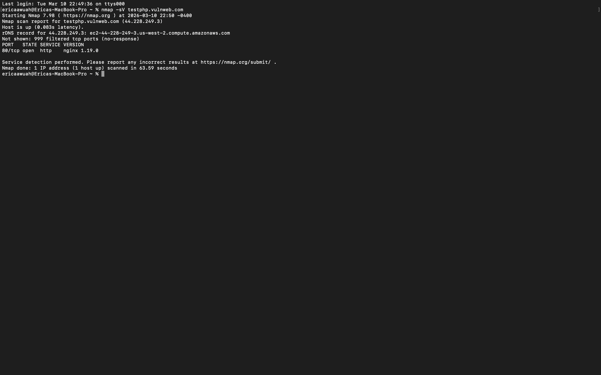
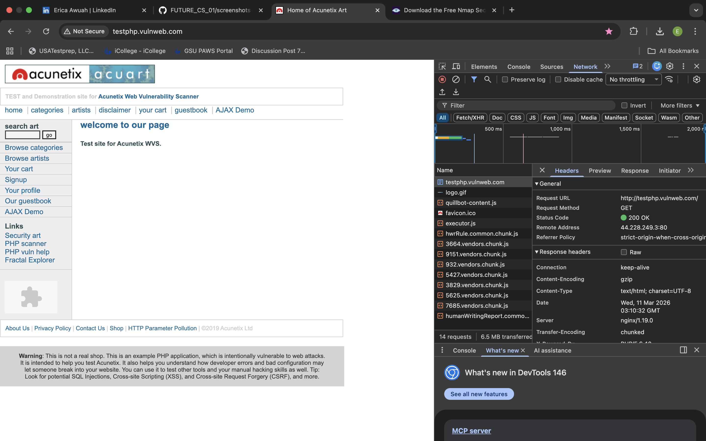

# FUTURE_CS_01

## Cybersecurity Web Scan Project

This project demonstrates basic cybersecurity reconnaissance techniques using Nmap and browser developer tools.

### Tools Used
- Nmap
- Google Chrome Developer Tools
- GitHub

### Step 1: Nmap Scan
A service version scan was performed on the test site:

testphp.vulnweb.com

Command used:
nmap -sV testphp.vulnweb.com

Result:
The scan identified that port 80 is open and the server is running nginx version 1.19.0.

### Step 2: Web Application Analysis
Using Chrome Developer Tools, the Network tab was inspected to view HTTP headers and server responses.

Findings:
The server header confirms the web server is nginx/1.19.0.

### Purpose
This project demonstrates how security analysts gather information about web servers during the reconnaissance phase of a security assessment.

## Key Findings

### Finding 1: Server Version Disclosure
The Nmap scan revealed that the web server is running nginx version 1.19.0 on port 80.

Risk Level: Low

Explanation:
When a server reveals its software version, attackers can search for known vulnerabilities associated with that version.

Recommendation:
Configure the server to hide or limit version information in HTTP responses.

### Finding 2: Information Disclosure in HTTP Headers
The HTTP response headers exposed the server type and version information.

Risk Level: Low

Explanation:
Exposing server details in HTTP headers can assist attackers in fingerprinting the system and identifying potential attack paths.

Recommendation:
Disable unnecessary header information and configure secure server headers.

### Screenshots

#### Nmap Scan Result

#### HTTP Header Analysis

